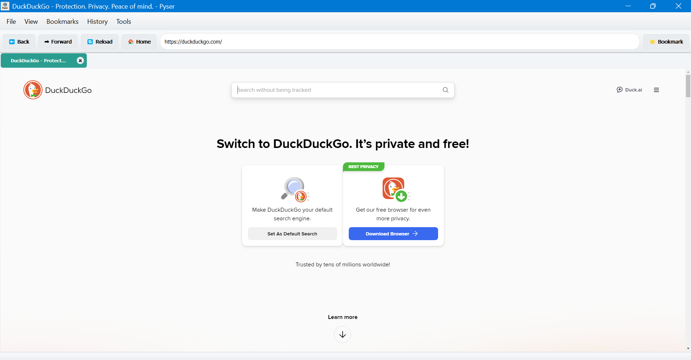

The Privatest Browser ever made. No tracking at all. Browse anonymously without worrying.

Major update:
This is V2 of Pyser.
Major New Features:
🗂️ Tab System

Multiple tabs with close buttons
Double-click empty space to create new tabs
Keyboard shortcuts (Ctrl+T for new tab)

📚 Bookmark Management

Add bookmarks with custom names
Bookmark dialog with organized view
Persistent storage in JSON file
Quick bookmark button in toolbar

📜 History System

Automatic history tracking
History dialog showing recent visits
Clear history functionality
Timestamps for each visit

⬇️ Download Manager

Download tracking window
Clear completed downloads
Visual download status

⚙️ Settings Dialog

Homepage configuration
Zoom level settings
JavaScript enable/disable
Image loading toggle

🎛️ Enhanced Navigation

Improved URL handling (auto-adds https://)
Search functionality (searches on DuckDuckGo if not a URL)
Status bar with loading progress
Better error handling

⌨️ Keyboard Shortcuts

Ctrl+T: New tab
Ctrl+N: New window
Ctrl+D: Add bookmark
Ctrl+H: Show history
F5: Reload
F11: Fullscreen toggle
Ctrl++/-/0: Zoom controls

🎨 UI Improvements

Professional menu bar
Progress bar for page loading
Status messages
Window title updates with page title
Tab titles truncate long names

💾 Data Persistence

Bookmarks saved to bookmarks.json
History saved to history.json
Settings applied across all tabs

How to Use?
Install PyQt5 if you haven't: pip install PyQt5
Run the browser - it will create bookmark and history files automatically

The browser now feels much more like a modern web browser with professional features while maintaining the simplicity of your original design. All data is stored locally in JSON files, so your bookmarks and history persist between sessions.